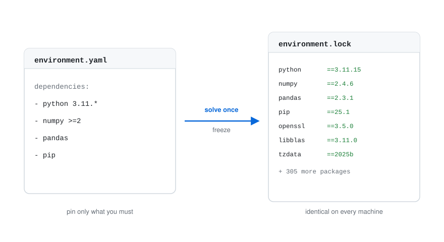
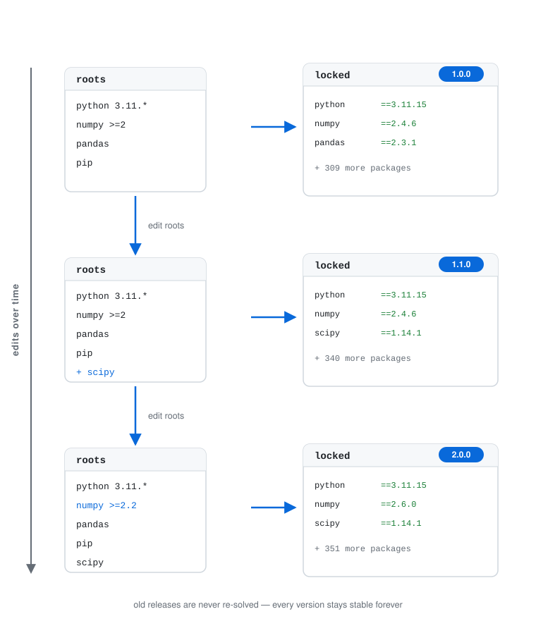

# nepenthe

Forget your environment sorrows

[](https://github.com/Point72/nepenthe/actions/workflows/build.yaml)
[](https://codecov.io/gh/Point72/nepenthe)
[](https://github.com/Point72/nepenthe)
[](https://pypi.python.org/pypi/nepenthe)

**nepenthe** builds, versions, and distributes large shared conda/PyPI
environments. Describe an environment once, solve it **once** with
[rattler](https://github.com/conda/rattler), freeze it into a portable lockfile,
and publish that lock to a versioned registry on any storage backend — so every
machine installs the exact same environment without re-solving.

- **Manifest-based composition** — declarative environments instead of scattered requirement files
- **Native solving** — rattler in pure Rust, no Python interpreter overhead
- **Portable locks** — multi-platform `rattler_lock` files, reproducible by construction
- **Cross-platform** — solve `linux-64` / `osx-arm64` / `win-64` from one host into a single multi-platform lock
- **Pluggable backends** — read/write specs to `file://`, `s3://`, `https://`; channels point at any server (e.g. an internal Artifactory)
- **Versioned registry** — independent per-environment versioning, immutable content-addressed locks
- **Install without conda** — link a lock into a prefix with rattler; no conda/mamba/micromamba required
- **Conda-compatible** — export any lock as an `@EXPLICIT` spec for `conda create --file`
- **Secure by default** — credentials injected at use time, never written into artifacts

nepenthe covers the full producer → consumer lifecycle: compose a manifest,
solve and freeze multi-platform locks, publish them to a versioned registry, and
install them without conda — from the CLI or Python, with air-gapped `pack` /
`unpack` bundles and a `pyproject.toml` integration that keeps a project's
dependencies in sync with the environment it consumes.

## Why nepenthe?

To behave consistently across many machines and over time, you want **frozen
environments**. But pinning everything by hand makes upgrades miserable and
leads to [dependency hell](https://en.wikipedia.org/wiki/Dependency_hell).

nepenthe starts from a list of dependencies where you pin only what you must.
Each release **solves once** and freezes the result into a fully-pinned
collection, so every download gives the **same** packages — installed without
re-solving.

<br />

<picture>
  <source media="(prefers-color-scheme: dark)" srcset="docs/img/frozen-environment-inverted.svg">
  
</picture>

<br />

You evolve an environment by editing its **root** dependencies, not the solved
set; each release produces a new frozen environment, and teams move between
versions on their own timeline.

<picture>
  <source media="(prefers-color-scheme: dark)" srcset="docs/img/environment-evolution-inverted.svg">
  
</picture>

This is different from per-project lockfiles (pixi, uv) and re-solved manifests
(`environment.yml`): nepenthe builds and distributes a **shared environment that
many repos consume**, versioned and immutable. See
[Motivation](docs/wiki/Motivation.md) for the full comparison.

## Documentation

| For                                            | Read                                                                                                                                                                                                                                                                                                                                                                                      |
| ---------------------------------------------- | ----------------------------------------------------------------------------------------------------------------------------------------------------------------------------------------------------------------------------------------------------------------------------------------------------------------------------------------------------------------------------------------- |
| **Why it exists** — the problem & alternatives | [Motivation](docs/wiki/Motivation.md)                                                                                                                                                                                                                                                                                                                                                     |
| **Users** — concepts and how-to                | The [wiki](docs/wiki/Home.md): [Concepts](docs/wiki/Concepts.md), [Manifests](docs/wiki/Manifests.md), [Channels & Artifactory](docs/wiki/Channels.md), [Registry](docs/wiki/Registry.md), [Installing](docs/wiki/Install.md), [Consuming in a Project](docs/wiki/Projects.md), [Packing](docs/wiki/Packing.md), [Python API](docs/wiki/Python-API.md), [Backends](docs/wiki/Backends.md) |
| **Getting started**                            | [Installation](docs/wiki/Installation.md)                                                                                                                                                                                                                                                                                                                                                 |
| **Contributors** — how it's built              | [Architecture](docs/wiki/contribute/Architecture.md)                                                                                                                                                                                                                                                                                                                                      |

## Quickstart

From a dependency list to a solved environment — a portable **lockfile** and a
conda-installable **spec file** — with no registry and no conda. Describe the
environment in a small manifest, pinning only what you must:

```yaml
# environment.yaml
project:
  name: demo
  channels: [conda-forge]
  platforms: [linux-64]
  python: ["3.11"]

dependencies:
  - numpy >=2
  - pip

environments:
  app: []
```

**Solve it once** into a fully-pinned, multi-platform lockfile — no registry, no
conda:

```bash
nepenthe build --manifest environment.yaml --env app --output-dir .
# → app-py3.11.lock      the reproducible artifact: every install gives these exact packages
```

**Want a conda spec?** Render the lock as a `conda create --file` (`@EXPLICIT`)
spec — so people who use conda/mamba can install it too:

```bash
nepenthe export --env app --lock app-py3.11.lock --platform linux-64 -o app.txt
# → app.txt              @EXPLICIT list of package URLs
```

**Install it** — straight from the spec with conda, or from the lock with
nepenthe (no conda required):

```bash
# with conda/mamba, from the spec — nepenthe not needed on this machine
conda create --name app --file app.txt

# …or publish the lock to a versioned registry and install with nepenthe — no conda:
nepenthe build --manifest environment.yaml --env app \
  --registry file:///srv/nepenthe --version 1.0.0
nepenthe create app --registry file:///srv/nepenthe --python 3.11 --prefix ./envs/app
eval "$(nepenthe activate --prefix ./envs/app)"
```

That's the whole vision: **describe once, solve once, distribute everywhere** —
as a versioned lock for nepenthe consumers and an `@EXPLICIT` spec for conda
users, from the same solve.

The CLI is a single multicall binary: `np` and `npb` are symlinks to `nepenthe`
(dispatch on the invoked name). `np` behaves exactly like `nepenthe`, and `npb`
is a shortcut for `nepenthe build` (so the build step above is just
`npb --manifest environment.yaml --env app --output-dir .`).

The same lifecycle is available from **Python** (a binding that mirrors the CLI,
no conda required):

```python
import nepenthe

# producer: solve "app" and publish its lock as v1.0.0
nepenthe.build("environment.yaml", "app", registry="file:///srv/nepenthe", version="1.0.0")

# consumer: install the latest published lock into a prefix
nepenthe.create("app", "file:///srv/nepenthe", "./envs/app")
print(nepenthe.activate("./envs/app"))
```

A repo that consumes a shared environment can pin it in its `pyproject.toml` and
keep its own dependencies honest against it:

```toml
[tool.nepenthe]
environment = "app"
registry = "file:///srv/nepenthe"
version = "1.0.0"
```

```bash
nepenthe sync      # install the referenced environment into .venv
nepenthe check     # verify [project.dependencies] are compatible (fails on conflicts)
```

See [Installing Environments](docs/wiki/Install.md) for the complete CLI
reference, [Consuming in a Project](docs/wiki/Projects.md) for the
`pyproject.toml` workflow, [Python API](docs/wiki/Python-API.md) for the Python
surface, [Manifests](docs/wiki/Manifests.md) for the manifest format, and the
runnable [`rust/examples/`](rust/examples) for the producer side.

## Contributing

Contributions are welcome under the [Apache 2.0 license](LICENSE). See
[Contributing](docs/wiki/contribute/Contribute.md) and
[Build from Source](docs/wiki/contribute/Build-from-Source.md).
