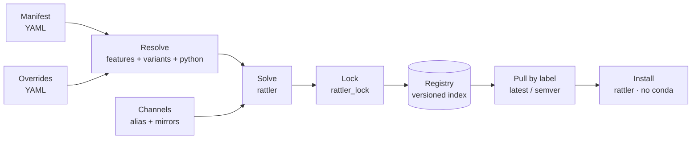

# nepenthe

> _Forget your environment sorrows._

**nepenthe** builds, versions, and distributes large shared conda/PyPI
environments. You describe an environment once in a declarative manifest, solve
it **once** with [rattler](https://github.com/conda/rattler), freeze the result
into a portable lockfile, and publish that lock to a versioned registry on any
storage backend — so every machine installs the exact same environment without
re-solving.

This wiki is the **user guide**. If you want to know how nepenthe is built
internally, see the [Architecture](Architecture) page under Contributing.

## Quickstart

From a dependency list to a solved environment — a portable **lockfile** and a
conda-installable **spec file** — with no registry and no conda. Pin only what
you must:

```yaml
# environment.yaml
project:
  name: demo
  channels: [conda-forge]
  platforms: [linux-64]
  python: ["3.11"]

dependencies:
  - numpy >=2
  - pip

environments:
  app: []
```

```bash
# solve once → a fully-pinned, reproducible lock
nepenthe build --manifest environment.yaml --env app --output-dir .
# → app-py3.11.lock

# render the lock as a conda `@EXPLICIT` spec, for conda/mamba users
nepenthe export --env app --lock app-py3.11.lock --platform linux-64 -o app.txt
# → app.txt

# install it — with conda from the spec, or with nepenthe (no conda) from a registry
conda create --name app --file app.txt
```

That's the vision: **describe once, solve once, distribute everywhere** — a
versioned lock for nepenthe consumers and an `@EXPLICIT` spec for conda users,
from the same solve. Read on for the full producer → consumer lifecycle.

## What problem does it solve?

Teams that share a big environment across many repos and machines hit the same
walls: slow installs from re-solving, drift between machines, environment
metadata smuggled into filenames, hardcoded package servers, and secrets leaking
into published specs. nepenthe fixes these by treating an environment as a
**versioned artifact**:

| You want… | nepenthe gives you… |
|-----------|---------------------|
| The same environment everywhere | Solve once → a hashed lock installed identically on every machine |
| Independent release cadences | Per-environment semver versioning (no global stamp, no filename encoding) |
| Your own package servers | Channels resolved to **any** URL (e.g. an internal Artifactory) — nothing hardcoded |
| Private packages without leaks | Credentials injected at use time from an auth store; never written into artifacts |
| Confidence a release is what you tested | Immutable, content-addressed locks; pulls are integrity-checked |

## How it fits together



1. **Author** a [manifest](Manifests) — features, environments, variants, and the
   channels to solve against.
2. **Layer** an [overrides](Manifests#override-layers) file to pin versions or
   set variant constraints without editing the manifest.
3. **Point channels** at your own servers — see
   [Channels & Artifactory](Channels).
4. **Solve** once and **export** a lock (the reproducible artifact).
5. **Publish** the lock to a [registry](Registry) and resolve it later by label
   (`latest`, `latest-but-one`, an exact version, or a semver range).
6. **Install** from the lock into a prefix with **no conda required** — see
   [Installing Environments](Install).

## Status

The full producer → consumer pipeline is implemented: manifest composition,
override layers, the rattler solve core, lock & compatibility exports, storage
backends (`file://`, `s3://`, `https://`), the versioned registry, the install
side (install a lock into a prefix without conda, plus `diff` / `status` /
`remove` / `activate`), and cross-platform support (solve many platforms from
one host into a single multi-platform lock). The `nepenthe` CLI drives the
consumer lifecycle. nepenthe can be used as a **Rust library**, via the CLI, or
from **Python** (a binding that mirrors the CLI). See [Installation](Installation).

## Where next?

- Why does this exist? Read **[Motivation](Motivation)** for the problem & alternatives.
- New here? Read **[Concepts](Concepts)** for the vocabulary.
- Authoring an environment? See **[Manifests](Manifests)**.
- Using internal package servers? See **[Channels & Artifactory](Channels)**.
- Publishing/consuming versions? See **[Registry & Versioning](Registry)**.
- Installing into a prefix? See **[Installing Environments](Install)**.
- Consuming an env from your repo? See **[Consuming in a Project](Projects)**.
- Shipping to an air-gapped host? See **[Packing](Packing)**.
- Driving nepenthe from Python? See **[Python API](Python-API)**.
- Storing specs/locks somewhere? See **[Storage Backends](Backends)**.
- Want to contribute? See **[Contributing](Contribute)**.
